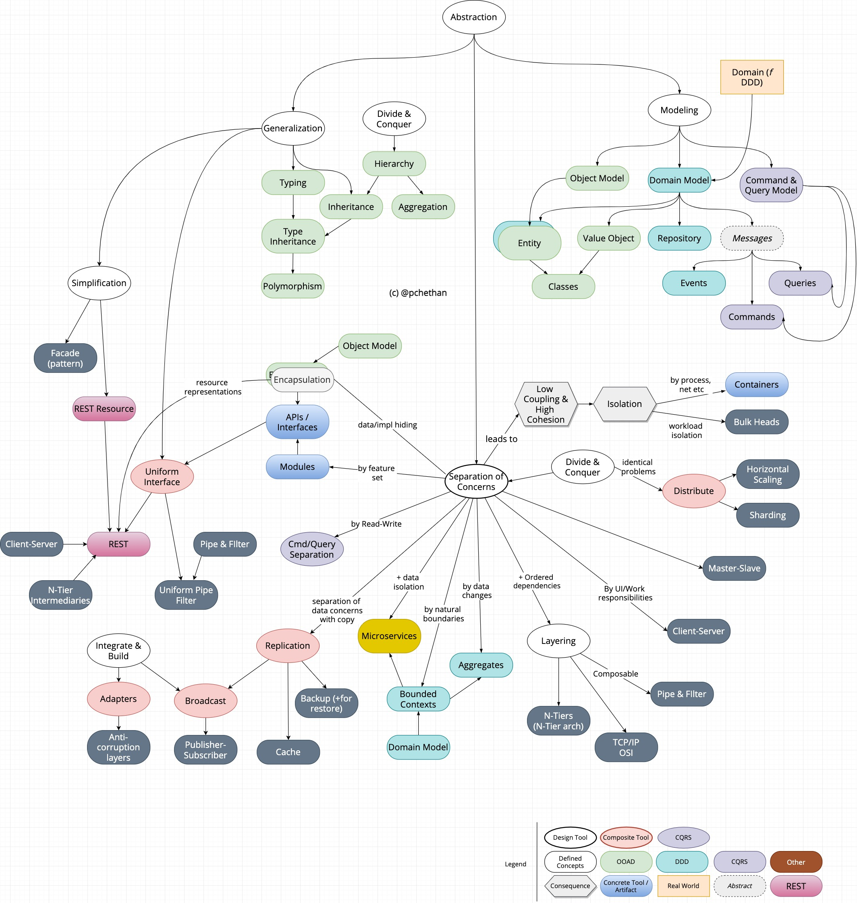

OOAD, Domain driven design, SOLID design principles, client-server, CQRS, Separation of Concerns, Facade, Adapter, Abstraction, Pipes & Filters, Microservices, Read-Write Separation, Model-View-Controller ... thats a lot of design choices at one's disposal, and the list appears very long. Its definitely disorenting even for the experienced. The list is growing[^1] by the day. 

Understanding design principles/patterns/approaches, knowing what they are at their core, their DNA, is extremely important. So are their relationships in relation to other. 

We need classification.

[This](https://en.wikipedia.org/wiki/Template:Design_Patterns_patterns) is helpful it soon becomes evident that its utility is limited. Client-Server, DDD are crammed into 'architectural patterns' box.  

There are various non-standard classifications everywhere. [This book](https://en.wikipedia.org/wiki/Pattern-Oriented_Software_Architecture) has classifications based on the problem domain (Synchronization patterns, Concurrency patterns), while [this](https://www.ics.uci.edu/~fielding/pubs/dissertation/top.htm) has based on the nature of the patterns (Hierarchical, Peer-to-Peer). 

May be there is some thesis which has a good look at all of them, but I can't find one. So, I compiled my notes and decided to classify them, based on the fundamental design tools that are used in creating them. 

Before we go further, let me clarify what I mean by 'design tool'. A design tool (for lack of a better name [^2]) is a tool, when applied, solves a design problem. Divide-and-conquer is a good example, although it is not specific to software domain. Such a tool could combine and evolve resulting in composite design tools. For example, Polymorphism is derived from Typing, which is based on [Generalization](https://en.wikipedia.org/wiki/Generalization) which itself is based on Abstraction. 

There is a distinct advantage with this type of classification. Design tools unlike other classification criteria, induce their distinct [qualities](https://en.wikipedia.org/wiki/List_of_system_quality_attributes) (or '-ilities'), into whichever composite tool or design approach that use them. The resulting qualities make an excellent way to measure the soundness/applicability of any design to a design problem. 

Plus, the classification embodies how a problem is solved; So, two design patterns/approaches which can be used as alternatives, appear together as related.

Plus, the classification shows the unique parts of a design. For e.g., layered architecture is just separation of concerns. The unique part is the ordered dependencies.

This is not new. There is already an excellent example of such classification, quantification and conclusion - REST. Roy Fielding's thesis[^3] derives REST from various architectural styles. His derivation graph (reproduced below for convenience) shows (relatively) simpler styles combining and evolving into composite styles while their qualities are combined and mixed in the process. Roy Fielding traces REST's final [resultant qualities](https://www.ics.uci.edu/~fielding/pubs/dissertation/net_arch_styles.htm#sec_3_9) from this derivation graph.

Here is my attempt at creating a one such classification [^3].

I confess that the image may not be 100% accurate and in now way complete. This image was originally my notes. I have been using it for discussions with colleagues in my organization. It has been evolving over time as I learn more and put more thought into their relationships. I intend to publish an update when the image grows significantly.

I hope you find this useful and intriguing. Do write to me if you have any comments / suggestions.

[^1] https://docs.microsoft.com/en-us/azure/architecture/patterns/#catalog-of-patterns

[^2] I use 'design tool' as opposed to 'design principle', because a principle, in common usage today, refers to something concrete like 'single responsibility principle'. I found the word 'tool' to be more appropriate, because it is a thing you can apply and achieve something. I am also not aware if there is any better term already defined somewhere..

[^3] Roy Fielding’s dissertation: https://www.ics.uci.edu/~fielding/pubs/dissertation/top.htm

