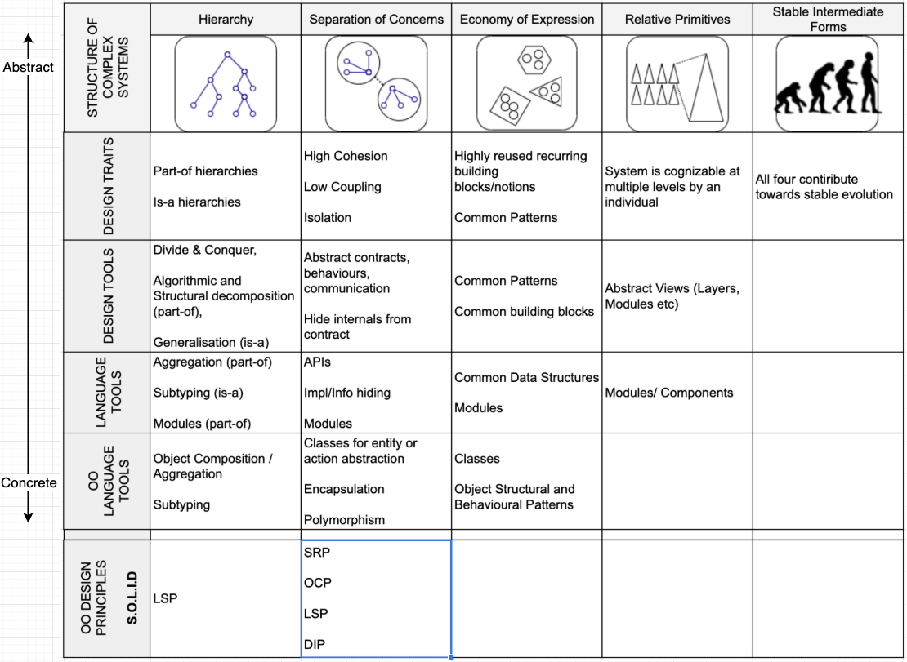

Object oriented design is one of the most widely used design methodologies even today.

In their popular book "Object-Oriented Analysis and Design with Applications", the authors (Grady Booch et al), list and describe qualities of successful complex systems (social structure, structure of plants etc).
- Hierarchy
- Separation of Concerns
- Economy of expression
- Relative Primitives
- Stable intermediate forms.

They posit that features of object modeling and design synergestically help achieve the qualities of complex systems. 

Below chart is a summary of 'how'. The chart arranges various OO features and their abstract/concrete forms in two dimensions, categorised by the 5 benefits they impart and the degree of abstractness.

The utility of this chart is seen when we evaluate SOLID OO-principles on this chart.  We see areas in which SOLID principles help system design, where they do not and the degree of their contribution.

 

