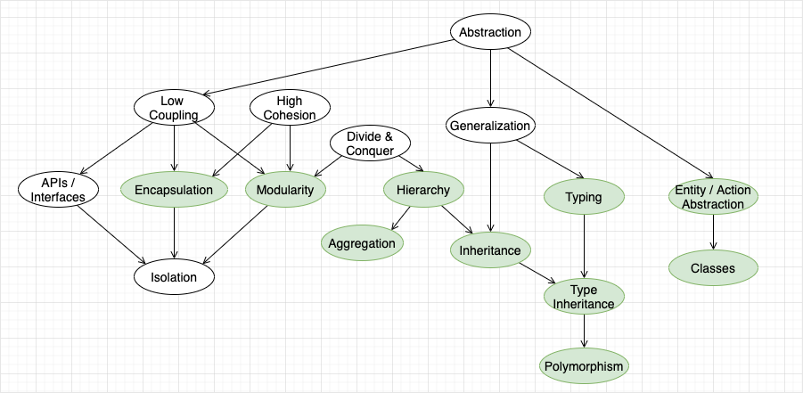

Here is a derivation of OO features from relatively abstract design traits and tools (arrow is derivation)

The style of derivation diagram is inspired from [1]

#### References
[1] [REST Style derivation](https://www.ics.uci.edu/~fielding/pubs/dissertation/rest_arch_style.htm#sec_5_1)

 

