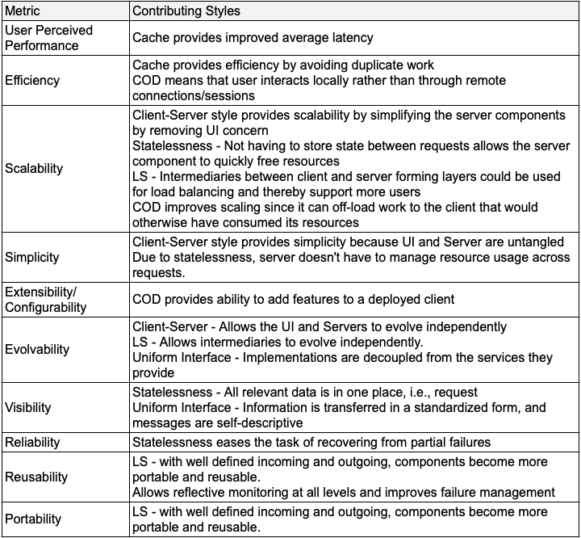
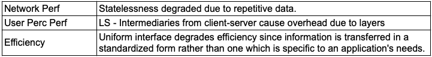
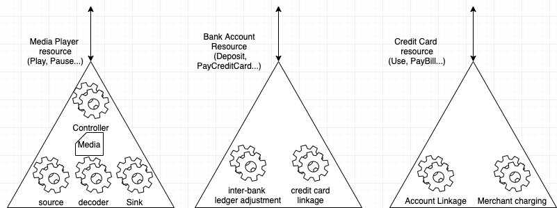
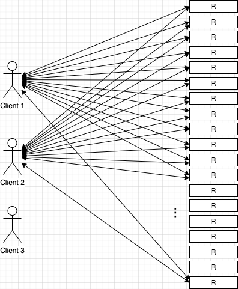
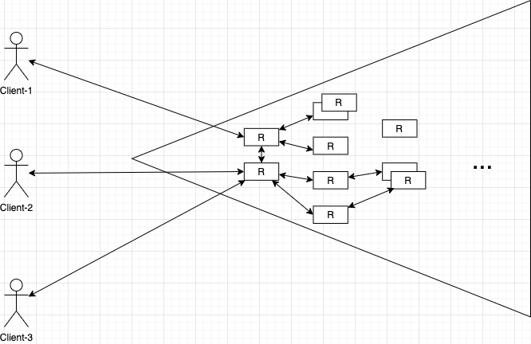

In the context of web services, the term API almost always refers to REST API. It is at the heart of most cloud services we see today. Creation, maintenance, and evolution of REST APIs is one of the most important design activities in web service development.

For something that is so ubiquitous, there are countless articles, videos which are inaccurate and contradicting. To this day, Roy Fielding’s dissertation[1] and his blog[2] serve as the only authoritative references. The good thing is that both the dissertation and blog are easy to read and understand.

This is an aggregation of my notes from reading these references. I have written it as a note to myself. But I hope its useful to you.

### Prerequisite
Before you proceed, its probably best to have some background on REST APIs, and know what an 'architectural style' is.

An architectural styles imposes certain constraints. Terms 'Style' and 'Constraint' are used interchangeably here.

### Outline
- Briefly state first five REST constraints
- Look at their consolidated benefits
- When do we stand to lose benefits?
- Notes on Uniform Interface
- Compare Resource with a façade interface
- Why HATEOS is important - its adoption, applicability for a medium size org.
- Disadvantages of REST

### 6 Constraints
REST is an architectural style for designing *communication* for network-based application software.

It is an aggregation of 6 architectural styles, which, together, synergistically provide internet scale to any network based application, by powering the communication between components.

- Client-Server +
- Statelessness +
- Layered Systems +
- Code-on-demand +
- Cache +
- Uniform Interface

### Five Constraints (LCODC$SS)
Roy Fielding chose 5 network-based architectural styles/constraints out of the many that he evaluated for their merits and demerits. Brief description of styles:

1. Client-Server (CS):    
    Separation of concerns — Client is concerned with UI & everything else is a concern of server.
Server provides services on request.

1. Statelessness: (S)

    State per client occupies space in memory and disk which are at a premium on servers. This prevents scaling. Interfaces are designed such that server never holds any data for future requests. Requests and responses therefore include all the information required.

1. Layered Systems (LS)
    
    - Multiple systems could be layered between client and server. An arrangement of systems in a unix pipe like fashion could lead to feature rich systems due to composability similar that of unix.
    - Systems participating in data path help with security and many rich transformation features (firewalls, traffic inspectors, parental controls etc)
    - Systems participating in routing help with scale (proxies and gateways)
    
    
1. Code-on-demand (COD)
    
    Download code that has the ‘know-how’ and run on client. The ‘know-how’ could be understanding server responses, rendering them and even knowing how to interact with server and get responses. Example: JS based web app.

1. Cache ($)
    
    Cache provides interface of a server and consumes interface of a server and provides caching in a transparent way. It can be part of layered systems or could be just a library at client or any layered systems
    
_(I urge you to read further from Section 3 of [^1] and the literature from where they are sourced [^3].)_

This is probably the best representation of five styles from the thesis.

#### Benefits
R. Fielding summarises his evaluation of individual styles and their combinations against various metrics in Table 3–6 of [1] (captured below). 

_Source: Table 3–6 of [1]_

The highlighted row **LCODC$SS** is evaluation for combination of five styles listed above: LS+COD+CS+S+$. The + and - indicate pros and cons which are described in other parts of [1]. For convenience, I have expanded the row into below table replacing the plusses and minuses with what they stand for. This provides a clearer perspective of contribution of individual styles towards the overall benefit.    

**Pros:**

**Cons:**

#### Loosing Benefits

With this perspective, it becomes clear as to what we stand to gain or lose if an individual style were used or not used. For example - 
- Cache is not used
- APIs have session
- Server API response is in HTML
- Payloads are encrypted and cannot be read by intermediaries (e.g., https)
- There is a single URL with action specified in payload (RPC style)

### Uniform Interface
#### 'Uniform'?
These above requirements from LCODC$SS can be met while designing the interfaces in different ways by individuals/companies with varying degrees of commonality. REST proposes a ‘common set of constraints’ that address these requirements, while also providing additional benefits. This commonality makes all interfaces *'Uniform'*.

#### Goals
While the five constraints existed before, the uniform interface constraint did not and was conceived and included in REST. Its the most distinct feature of REST. 

Roy does not explicitly setout goals or needs that spurred this constraint, but I think its useful to deduce from [^1] and [^2]

1. Provide Data Encapsulation
1. Bringing evolvability from browser-HTML-server success story. (See [this](https://www.ics.uci.edu/~fielding/pubs/dissertation/evaluation.htm#sec_6_1))
1. Work well with other styles (See previous section)

 

#### Four Interface Constraints
REST is defined by four interface constraints
* Identification of resources;
* Manipulation of resources through representations
* Self-descriptive messages; and,
* Hypermedia as the engine of application state

 

##### Identification of resources 

> The key abstraction of information in REST is a 'resource'. Any information that can be named can be a resource.[^1]

A REST API is accessor or manipulator of resource. 

Diving a larger information space into smaller abstract resources, is similar to a façade interface pattern.

Examples:

Identification of resources is a key design activity that requires understanding of the domain, to decide the right granularity and abstractions for resources.

So the benefits of resource are clear
* least coupling
* late binding
* conceptual conciseness, 
* efficiency of communication 

##### Manipulation of resources through representations
A representation as the name suggests, represents a resource. Manipulating resources by transfering only the representations which contains data which maps to a resource at a concept level.

Example: A hospital may have an 'Appointment' resource for consulting with doctors. It may contain start time, end time, doctor's name/id, consulting room name etc. But a more complex data structure may be behind an appointment with references to doctor's calendar, etc. 

###### Data Encapsulation
Representations provide data encapsulation we talked about in  section above

##### Self-descriptive messages
Interaction is stateless between requests, standard methods and media types are used to indicate semantics and exchange information, and responses explicitly indicate cacheability.

Self-descriptive messages is also a requirement of LS style.

##### Hypermedia as the engine of application state (HATEOAS)

The goal of HATEOAS is *evolability* - similar to one achieved browser-HTML-server success story. 

*Browser-HTML-server aka Hypertext Web*: A user visits a site and navigates as he/she chooses. A user always starts from home page, optionally logs in, navigates as per his/her needs to finish a task. The developers of the site are free to change the navigation structure of the site at will, without breaking anything and without causing any inconvenience to user.

This gives a high level of independent evolvability to the server. A server can

* Change URI structure
* Add/remove resources
* Change representations
* Remove relationships between resources

Intention of HATEOAS is to achieve the same success with REST. Broadly, the contraints are:

1. Loose Coupling: 
    Clients should be able to start with a bookmark URI and navigate resource heirarchy/model through URIs provided by server responses. Client is coupled with only the initial URI or few URIs. Server is free to change the resource namespace.

1. Common Vocabulary: 
    Clients must understand responses and be able to construct requests by an understanding of media-type that is shared with clients beforehand (For e.g., a clients knows how to render text/html and client knows how to make form submissions). That is client and server have a common vocabulary, that may be domain agnostic or domain specific. So, it is possible that the media type could be standardised fully (e.g., Atom) or partially (HAL)

See [^2] for more details

##### HATEOAS Adoption
There isn’t a lot of adoption of HATEOAS. 

>REST is software design on the scale of decades: every detail is intended to promote software longevity and independent evolution[^4]

Many believe that they are not building APIs for web scale or for the longitivity of decades and may never see returns.

I believe the benefits are not only for projects like Atom, but are also for all platforms of medium to large size.

##### Applicability for a medium scale org/service
Lets consider a SaaS service with 200 APIs. Lets consider that the organization which is providing this service has multiple tenants and multiple UI clients per tenant.

Below diagram show how complex it would be to undertake a change in server, without resorting to API versioning and adding clients with intelligence to be compatible with the migration process.

It is more of a problem for native clients, than web clients which are more dynamic (COD) 

API versioning with version in URL would mean that the client entirely switches to a new version with a base url containing new version. This prevents partial evolution and may introduce duplication of code. 

Contrast this with the HATEOAS approach

An additional indirection gives return on investment in the evolution of servers, even though it seems overly complex to fetch just one URL.

#### Disadvantages of REST
There is an efficiency trade-off. 
There is an efficiency trade-off. (See [contributions above](https://pchethan.github.io/2020/06/19/REST.html#cons))

Dissertation:
>Uniform interface degrades efficiency, since information is transferred in a standardized form rather than one which is specific to an application’s needs. The REST interface is designed to be efficient for large-grain hypermedia data transfer, optimizing for the common case of the Web, but resulting in an interface that is not optimal for other forms of architectural interaction

Even though the above statement is about the server’s needs, it applies equality to clients needs. To a server, all clients and their needs are equal.

If a business intends to support heterogenous clients varying highly with CPU, memory and software capabilities, this trade-off could prove expensive.

I believe here is where graphQL shines.

### Conclusion
Although Roy Fielding does not agree to the idea calling an API as RESTful unless all constraints are applied — there are significant benefits to be gained from partial adoption.

I hope that this post provides some information/insight to
- Designing API to achieve benefits that matter in the context of your application/domain
- Evaluate existing REST APIs
- Qualitify what is gained or lost when a constraint is used/not used.
- Compare against alternatives

### References
[^1]: Roy Fielding’s dissertation: https://www.ics.uci.edu/~fielding/pubs/dissertation/top.htm

[^2]: Roy Fielding’s blog on REST: https://roy.gbiv.com/untangled/2008/rest-apis-must-be-hypertext-driven

[^3]: References of dissertation: https://www.ics.uci.edu/~fielding/pubs/dissertation/references.htm

[^4]: REST is software design on the scale of decades: every detail is intended to promote software longevity and independent evolution: https://roy.gbiv.com/untangled/2008/rest-apis-must-be-hypertext-driven#comment-724

