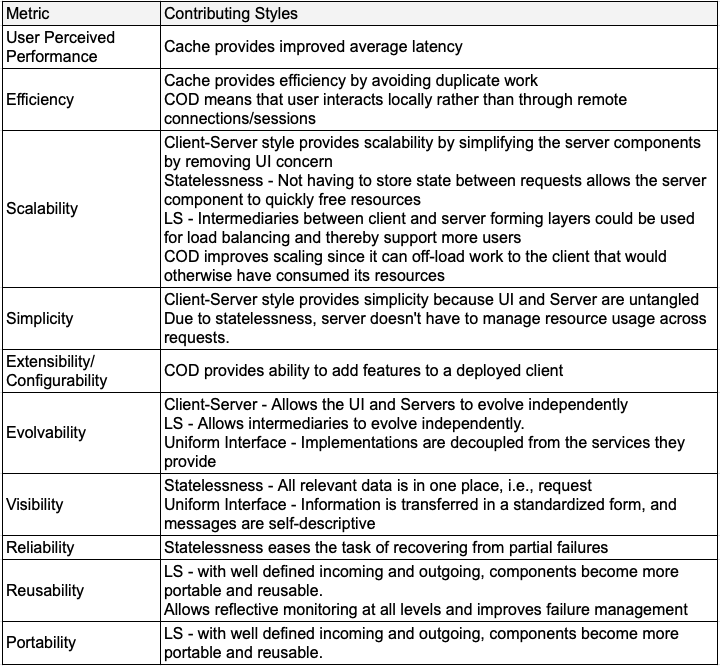

If you have heard of REST, you might have also heard of debates as to whether an API is RESTful or not. The disagreements typically range from URL syntax, naming resource, choice of HTTP methods upto how HATEOS must be implemented.

The dissertation[^1] only provides high level guidelines and does not dwelve into the nitty-gritties of url construction, syntax/nouns/verbs etc. Its not that its unspecified, its that it does not matter as long as you ensure that you construct APIs with 'Uniform Interface' constraint, without violating the other [5 network architecture styles](https://www.ics.uci.edu/~fielding/pubs/dissertation/rest_arch_style.htm). Ultimetely constraints exist to yield benefits, and benefits are the ones that matter. Everything else is about following conventions (at your org level or something that a big organization has formulated [^3]), not abusing protocol like HTTP, etc. Here are the benefits:

The key part of REST API design - 'the identification of resources' is subjective. Its a design activity that depends a lot on the domain. I don't want to get into definition of resources/representations. They are already well defined [here](https://www.ics.uci.edu/~fielding/pubs/dissertation/rest_arch_style.htm#sec_5_2). 

Assuming that we have the resources identifed, what does a RESTful  interface look like, as per the dissertation (which says that you can use any suitable protocol and HTTP is one of them)?

Guidelines can be deduced from the 6 constraints.

The second column in the table below captures requirements (relavent to client-server interaction) from each of the 6 styles. The third column captures what an interface must have to be able to address those requirements. 

This is almost close to Roy's clarification on his blog[^2]. 

While designing APIs, there are always cases where neither the thesis not the his blog help. Then, its best to make a choice that does not violate the 6 styles or loose any pros induced by them. Ultimately, "...lities" are the ones that matter.

[^1]: Roy Fielding’s dissertation: https://www.ics.uci.edu/~fielding/pubs/dissertation/top.htm

[^2]: Roy Fielding’s blog on RESTful APIs: https://roy.gbiv.com/untangled/2008/rest-apis-must-be-hypertext-driven

[^3]: Microsoft REST API Guidelines: https://github.com/microsoft/api-guidelines/blob/vNext/Guidelines.md

